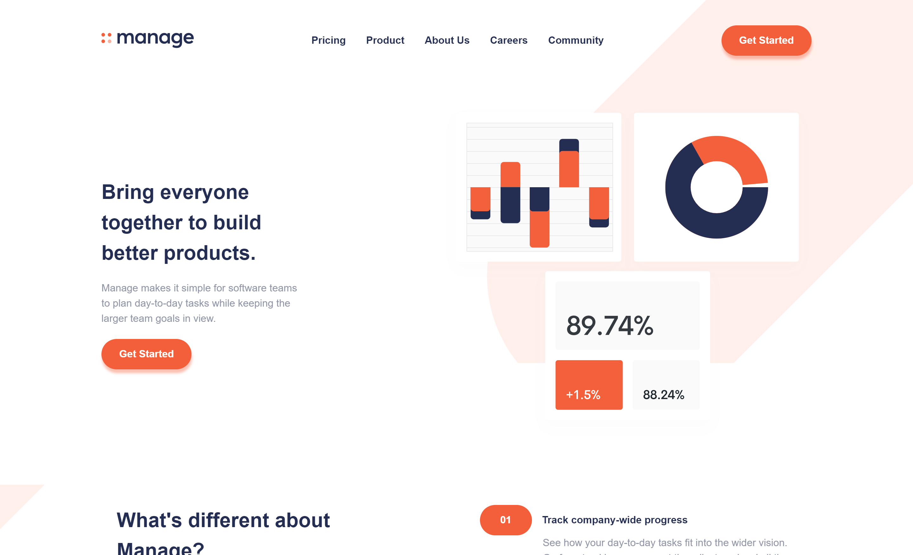
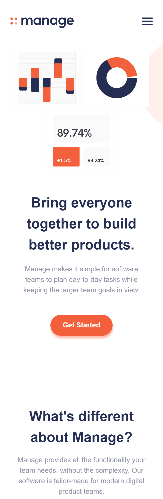

# Frontend Mentor - Manage landing page solution

This is a solution to the [Manage landing page challenge on Frontend Mentor](https://www.frontendmentor.io/challenges/manage-landing-page-SLXqC6P5). Frontend Mentor challenges help you improve your coding skills by building realistic projects.

## Table of contents

- [Overview](#overview)
  - [The challenge](#the-challenge)
  - [Screenshot](#screenshot)
  - [Links](#links)
- [My process](#my-process)
  - [Built with](#built-with)
  - [What I learned](#what-i-learned)
  - [Continued development](#continued-development)
  - [Useful resources](#useful-resources)
- [Author](#author)
- [Acknowledgments](#acknowledgments)

## Overview

### The challenge

Users should be able to:

- View the optimal layout for the site depending on their device's screen size
- See hover states for all interactive elements on the page

### Screenshot

### Links

- Solution URL: [https://manage-landing-page-psi-seven.vercel.app/](https://manage-landing-page-psi-seven.vercel.app/)
- Live Site URL: [https://manage-landing-page-psi-seven.vercel.app/](https://manage-landing-page-psi-seven.vercel.app/)

## My process

### Built with

- Next JS
- Tallwind CSS
- Tailwind-Styled-Components
- Styled-Components
- Flexbox
- CSS Grid

### Continued development

What next after this project? Well, it's to keep building more projects on Frontend Mentor and also learning new things along the way.

## Author

- Github - [@Joshardals] (https://github.com/Joshardals/)
- Frontend Mentor - [@joshardals](https://www.frontendmentor.io/profile/Joshardals)
- Twitter - [@Joshardals](https://www.twitter.com/joshardals)
